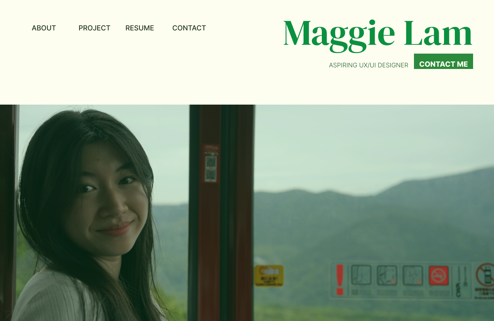
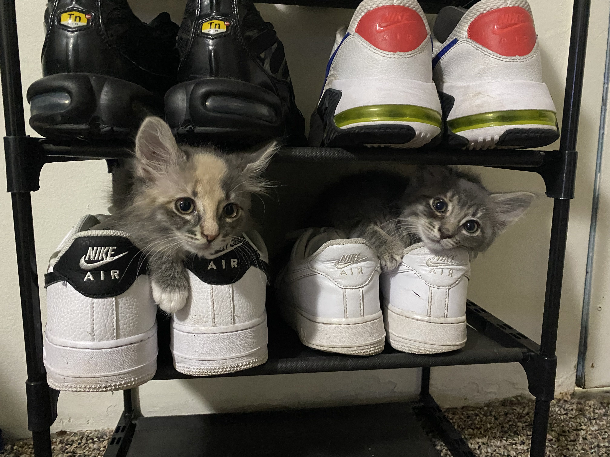

## Who am I? 
I would describe myself as a creative that loves arts and crafts 🎨. An energetic person who is eager to show off her skills and be a team player💫

**Pronoun: She/her**

## Overview of academic Journey

#### Design projects 
1. Spotify case study

   a. [Medium Casestudy Link](https://medium.com/@ml2568/10c5e9f2eeb6#05c6-dfa9ee89282f)
   
   b. [Link to Figma](https://www.figma.com/file/1oofRdHm98AIT94p92vl3k/ml2568---Spotify?type=design&node-id=101%3A3&mode=design&t=wedgRS54QxP9Z4tc-1)
2. Lee's International Super Market Website Figma
   a. [Link to Figma](https://www.figma.com/design/5K8n4Pyv0FOztzni1L69TS/Lee's-International-Foodmart?node-id=7-40&t=VnX76mxcthflSRP6-1)
3. CornYelp - hack challenge

   a. [Figma CornYelp Design](https://www.figma.com/file/FM3WnP3IRN6QCdUKiXI0Fy/CornYelp---Hack-Challenge-App?type=design&node-id=0%3A1&mode=design&t=lim5EOd0z4riWJCl-1)

#### Frontend Development 
1. About me website
2. [Apple Festival Website](https://github.com/MaggieLam2003/Apple-Festival-Website)
3. Form Submission POST example website
4. [Cat Adoption Website](https://github.com/MaggieLam2003/Cats-Adoption-Website)
5. [TedxCornell](https://github.com/MaggieLam2003/tedXCornell-Website)
6. [Prisoner's Express App](https://cornell-info4340-2024sp.github.io/vuetiful-ladies-project/)

#### IOS front end development 
1. [Gratitude journey | SwiftUI](https://github.com/MaggieLam2003/SWIFTUI-gratitude-journal-app)

#### Data science
1. [Global Happiness Factor](https://github.com/MaggieLam2003/Global-Happiness-Factors)

## What am I working on now? 
A portfolio website is in the works. . . 🛠️

#### Here is a quick sneak peak 

## How to reach me 
Email: <ml2568@cornell.edu>

Instagram: [Click Here!](https://www.instagram.com/_maggie.lam/?hl=en)

LinkedIn: [Click Here!](https://www.linkedin.com/in/maggie-lam-368150247/)

## What I am currently learning
1. Vue.js and Bootstrapiing
2. UX design in the telecommunication
3. Computing for Sustainability

## Fun Facts
I have 2 cats, Pluto 🌑 and Comet ☄, that I take care of :)

