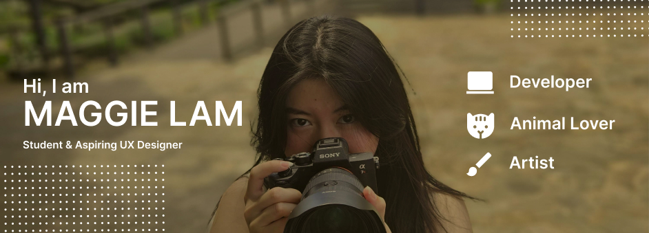

## Who am I? 
I would describe myself as a creative that loves creating things 🎨. An energetic person who is eager to show off her skills and be a team player💫

**Pronoun: She/her**

## Overview of academic Journey
#### Frontend Development 
1. About Me website
2. Apple festival ( html css js) 
3. Form submission - backend website 
4. Cat adoption website ( php sql) 
5. Ted x Cornell ( html css js ) 
IOS front end development 
1. Gratitude journey- hack challenge 

#### Design projects 
1. Spotify case study 
2. CornYelp - hack challenge 

#### Data science
1. Global Happiness Factor 

**Link: resume**

## What am I working on now? 
A portfolio website is in the works 🛠️
#### Here is a quick sneak peak 
1. Image

## How to reach me 
Email: ml2568@cornell.edu 
Instagram: 
LinkedIn: 

## What I am currently learning

## Fun Facts

