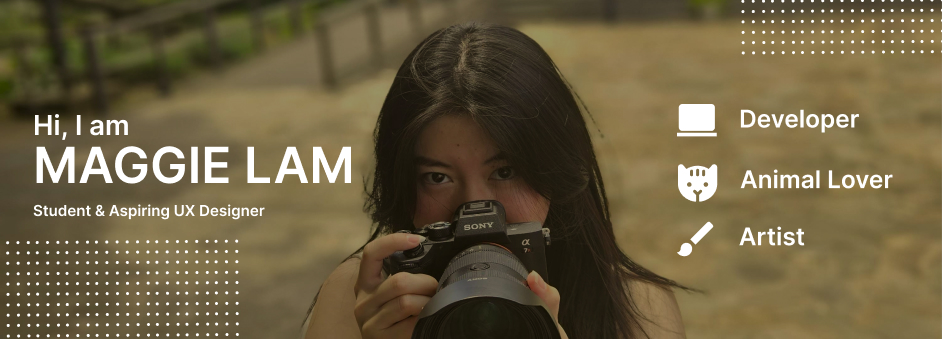

## Who am I? 
I would describe myself as a creative that loves creating things 🎨. An energetic person who is eager to show off her skills and be a team player💫

**Pronoun: She/her**

## Overview of academic Journey

#### Design projects 
1. Spotify case study
   a. [Medium Casestudy Link](https://medium.com/@ml2568/10c5e9f2eeb6#05c6-dfa9ee89282f)
3. CornYelp - hack challenge
   a. [Figma CornYelp Design](https://www.figma.com/file/FM3WnP3IRN6QCdUKiXI0Fy/CornYelp---Hack-Challenge-App?type=design&node-id=0%3A1&mode=design&t=lim5EOd0z4riWJCl-1)

#### Frontend Development 
1. About me website
2. Apple festival
3. Form submission 
4. Cat adoption website
5. Ted x Cornell
IOS front end development 
1. Gratitude journey- hack challenge 

#### Data science
1. Global Happiness Factor 

**Link: resume**

## What am I working on now? 
A portfolio website is in the works 🛠️
#### Here is a quick sneak peak 
1. Image

## How to reach me 
Email: <ml2568@cornell.edu>

Instagram: 

LinkedIn: 

## What I am currently learning

## Fun Facts
I have 2 cats, Pluto 🌑 and Comet ☄, that I take care of :)

